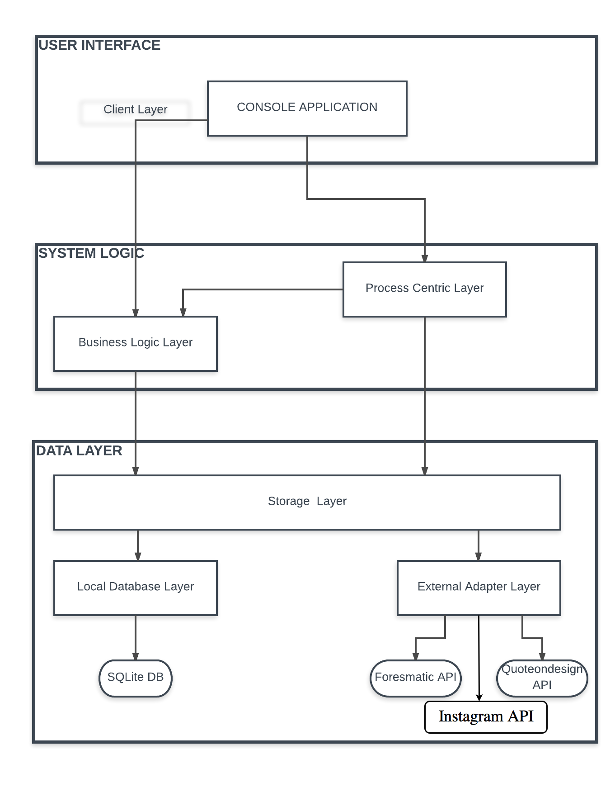

#LifeSaver APP web 
This project was developed as the final project for the course Introduction to Service Design and Engineering of University of Trento, trento, Italy.  
  
##Description of the application
The LifeSaver application allows a single user monitor his water consumption, hours of sleep and number of step daily. The user is encouraged with motivational quotes from external APIs (Forismatic API, Instagram API and Quoteondesign API) depending on reaching his goal.

##Application architecture
The application consists of five services that work independently. The interaction between the services are done using SOAP or REST technologies. The architecture of the application consists of following services:

* **Local Database Service:** 
 * Developed using SOAP web protocol. 
 * Interacts directly with the local SQLite database and creates the classes for all the tables.
* **Adapter Service:** 
 * Developed using REST architectural style. 
 * Responsible for interacting with external APIs, such as Instagram API, Forismatic API and Quoteondesign API, for requesting data through their APIs.
* **Storage Service:**
 * Developed using REST architectural style
 * Works as a middleman between the data sources and other services. Talks with the Local Database Service and Adapter Service and provides the data to other services in the application.
* **Business Logic Service:**
 * Developed using REST architectural style
 * Handles the GET requests coming from the User Interface layer: gets requests from the UI, asks proper data from Storage Service, processes it and sends it to the UI.
 * Handles the calculations if a user has reached a goal or not: gets the posted measure from Process Centric Services, gets the person goals, makes the calculations, gets timeline item, processes it and send it back to Process Centric Service.  
* **Process Centric Service:**
 * Developed using REST architectural style
 * Handles the PUT requests coming from the User Interface layer
 * Interacts with Storage Service for POST/PUT requests and Business Logic Service for checking if the user has reached its goals when new measures are posted.  
  
 

##Technological overview

**Backend programming environment**  
The backend services were built using Eclipse IDE and Java programming language.

**Local database**  
The local database was implemented using SQLite. It is a light relational database management system. SQLite does not need a database service, but it is embedded into the application.

**Frontend programming environment**  
The User Interface is a CONSOLE CLIENT INTERFACE.
**External APIs**  
* **FORESMATIC API:** For receiving motivational quote
* **QUOTEONDESIGN API:** For receiving motivational quotes
* **INSTAGRAM API:** For receiving image links
**Hosting**  
The codes of all the services are hosted on **GitHub**, under [LifeSaver ORG](https://github.com/LifeSaverApp). Under each service GitHub repository there are also Wiki pages. Each Wiki page contains the documentation of the services API endpoints.

All the services are hosted in **Heroku**, which is a cloud platform for deploying, running and managing web applications. 

**Conclusion**  
The LifeSaver console application is a simple prototype of how this kind of health application could work. The main focus of the project was the implementation of proper service architecture behind the application, which has been done. The user can get, create, update and delete measures and goals and the requests are sent properly through the service architecture.

For future the application could be enhanced by designing a more user friendly UI (Web or Mobile) and allowing multiple users. Also, other well to do APIs, suck as Google Fit, FitBit, Spotify can be used to better the efficiency and make it more fun.
